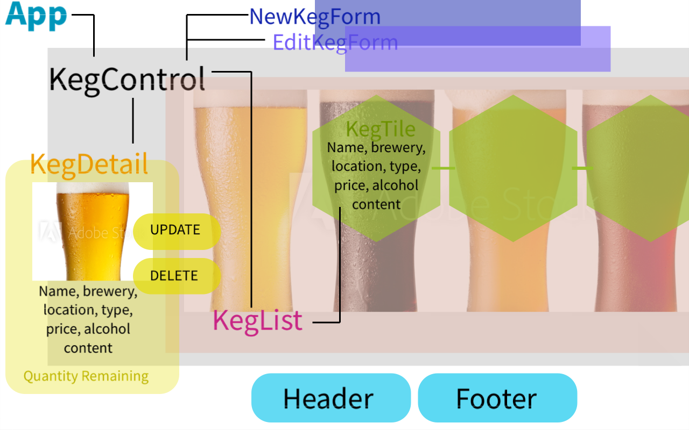
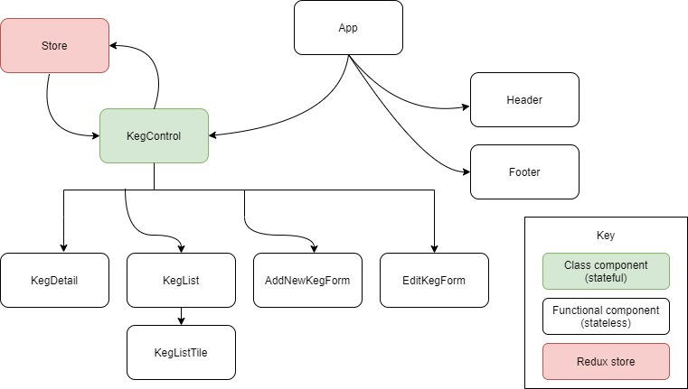

# Taproom (React Application)

## By _**Krista Rutz**_

#### A JavaScript (React/Redux) application for a taproom to keep track of its kegs, deployed on [Netlify](https://taproom-app.netlify.app/). _Created 05.01.2020_.

    

[Description](#Description) | [Technologies](#Technologies-Used) | [Component Diagrams](#Component-Diagrams) | [Run or Install](#Set-up) | [Current Bugs](#Known-Bugs) | [Contact and Support](#Support-and-Contact-Details) | [License](#License)

## Description

This application lets the user view kegs in a list, use a form to add new kegs to the taproom list, modify the number of pints remaining by selecting purchase, view more details for any keg, and edit or delete kegs.

This is a one-page application designed with functional React components and utilizing Redux state management. It was created for the Epicodus weeks 16-17 Friday independent project, during week 2 and 3 of the React course: "React Fundamentals" and "React with Redux".

#### Technologies Used:

- JavaScript
- Node.js, Node package manager
- React library
- Redux state container
- JSX/HTML
- Custom CSS and Bootstrap library
- Jest testing, test driven development (TDD)
- Git version control and GitHub

## Component diagrams

## Set-up

You can use the [Netlify app](https://taproom-app.netlify.app/) to run the current version of the program from your browser!

Otherwise, download or clone the repository to run this program locally.

- Once you have stored the files locally, execute the following commands.
  - Navigate to the application directory: \$ `cd taproom`
  - \$ `npm install`
  - \$ `npm start`
- Upon success, the program will begin running in your browser.

_This project was bootstrapped with [Create React App](https://github.com/facebook/create-react-app):_

Expand for more information on using Create React App

### Available Scripts

In the project directory, you can run:

#### `npm start`

Runs the app in the development mode. 
Open [http://localhost:3000](http://localhost:3000) to view it in the browser.

The page will reload if you make edits. 
You will also see any lint errors in the console.

#### `npm test`

Launches the test runner in the interactive watch mode. 
See the section about [running tests](https://facebook.github.io/create-react-app/docs/running-tests) for more information.

#### `npm run build`

Builds the app for production to the `build` folder. 
It correctly bundles React in production mode and optimizes the build for the best performance.

The build is minified and the filenames include the hashes. 
Your app is ready to be deployed!

See the section about [deployment](https://facebook.github.io/create-react-app/docs/deployment) for more information.

#### `npm run eject`

**Note: this is a one-way operation. Once you `eject`, you can’t go back!**

If you aren’t satisfied with the build tool and configuration choices, you can `eject` at any time. This command will remove the single build dependency from your project.

Instead, it will copy all the configuration files and the transitive dependencies (webpack, Babel, ESLint, etc) right into your project so you have full control over them. All of the commands except `eject` will still work, but they will point to the copied scripts so you can tweak them. At this point you’re on your own.

You don’t have to ever use `eject`. The curated feature set is suitable for small and middle deployments, and you shouldn’t feel obligated to use this feature. However we understand that this tool wouldn’t be useful if you couldn’t customize it when you are ready for it.

### Learn More

You can learn more in the [Create React App documentation](https://facebook.github.io/create-react-app/docs/getting-started).

To learn React, check out the [React documentation](https://reactjs.org/).

## Known Bugs

- No known bugs

## Support and contact details

Please contact me if you run into any issues or have questions, ideas or concerns. I can be contacted at <krista.rutz@pomona.edu>. Feel free to create a pull request for updates - _contributions to the code are encouraged!_

## License

Copyright (c) 2020 **_Krista Rutz_**

_This software is licensed under [the MIT license](./LICENSE)._
